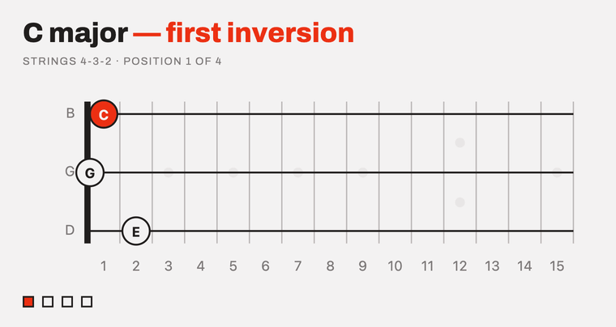

# Triad Trainer



Guitar triad drill. It hands you a chord on a string set, picked from whatever
you have practised least, and the metronome walks you through every inversion
of it from the lowest position on the neck to the highest, a bar to each shape,
wrapping back to the bottom until you stop.

You do not choose the chord. You tick which qualities, string sets and
inversions are in play, and it picks from those, leaning towards whatever you
have been neglecting. Every key gets the same exposure whether you like it or
not, which is the point.

## Using it

Three beats to a bar, one per note of the triad, and the shape changes on beat
one. Say the note before you play it.

The shape you are on is drawn solid. The drill's other positions sit behind it
as faint discs, so you can see the whole run up the neck and where you are
going next.

The squares under the diagram step through the positions by hand, for getting
your bearings before you start counting. Browsing is not practice, so nothing
you do there is logged.

**Done** logs the shape on screen and moves on to another chord. **New drill**
moves on without logging it. Both stop the metronome.

The practice log at the bottom shows what you have played and, more usefully,
what you have been avoiding.

## Saying "next"

While you are finding the shapes, the "Listen for next" toggle advances a
position when you say the word, so you can keep both hands on the guitar.

Worth knowing before you switch it on: the audio is not processed on your
machine. This is the browser's speech recognition, and Chrome implements it by
streaming microphone audio to Google's servers. It runs only while the toggle
is on, and it is off by default, but that is the trade. Chrome and Edge only.
Starting the metronome switches it off, since the clicks are all it would hear.

## Running it

Once, to install:

```sh
cd backend  && uv sync
cd frontend && npm install
```

Then, to run:

```sh
./scripts/dev.sh
```

Open <http://localhost:5173>. Ctrl-C stops both halves.

## Having it always there

To stop thinking about starting it:

```sh
./scripts/install-service.sh
```

That builds the frontend, has the API serve it so the whole thing is one
process on one port, installs a launchd agent that starts it at login and
restarts it if it dies, and puts a `triad-trainer` command on your PATH.

```sh
triad-trainer            # open it
triad-trainer status     # running? reachable where?
triad-trainer rebuild    # after changing code
triad-trainer logs
```

To reach it from your other machines, `triad-trainer serve` publishes it to
your tailnet over HTTPS at `https://<this-machine>.<tailnet>.ts.net:8443`. It
stays bound to loopback; Tailscale does the proxying, and nothing is exposed to
the public internet. HTTPS has to be enabled for your tailnet first, under DNS
in the admin console — without it the microphone is blocked on every machine
but this one, so voice stepping would not work remotely.

Your practice history lives in `backend/triads.db`, on this machine and nowhere
else. Deleting that file resets the log and nothing else.
